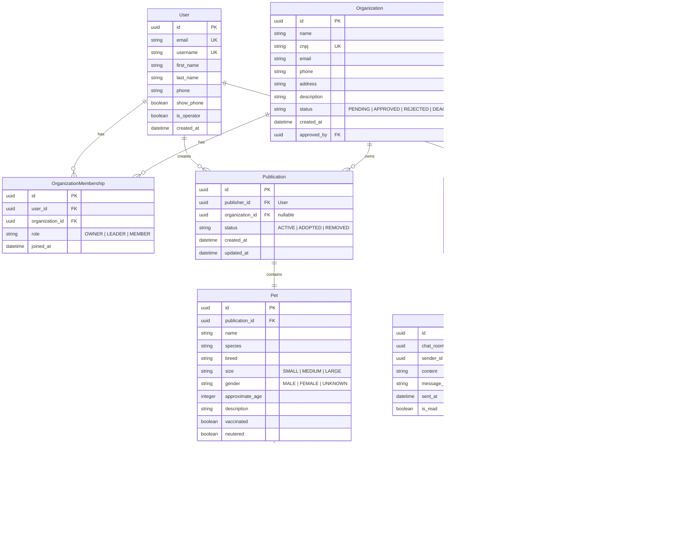
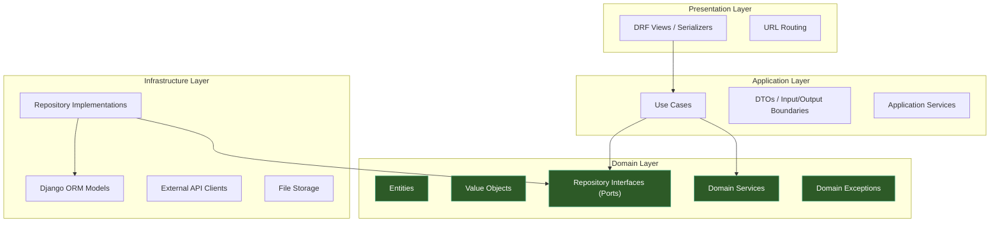
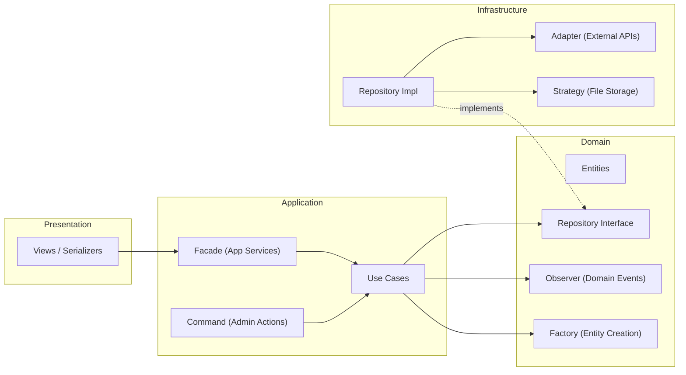
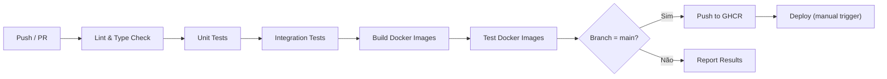

# Refatoração PetAdopt — Plano de Implementação

## 1. Visão Geral

### 1.1 Descrição do Problema

Plataforma de adoção de animais que conecta publicantes (pessoas ou organizações) a adotantes. O sistema atual é um monolito Django MVT com um único app `catalog`, um modelo `Pet` simples, e sem sistema de usuários além do `django.contrib.auth` padrão.

### 1.2 Objetivo

Refatorar o projeto para uma arquitetura de **microserviços** com **frontend e backend separados**, aplicando Clean Architecture, SOLID, TDD, BDD e Design Patterns — preparando o sistema para escalar, ser portado para mobile, e ser implantado em produção com Docker.

### 1.3 Estado Atual do Código

| Aspecto | Estado Atual |
|---|---|
| Arquitetura | Monolito Django MVT (templates Jinja) |
| Models | `Pet` único (name, species, description, image, is_adopted) |
| Views | 3 views (catalog, adopt, admin_dashboard) |
| Auth | `django.contrib.auth` padrão + login template |
| DB | SQLite |
| Docker | Dockerfile básico com `runserver`, compose sem DB |
| Testes | Nenhum (`tests.py` vazio) |
| Design Patterns | 5 (Singleton, Adapter, Factory, Facade, Command) em [patterns.py](file:///c:/Aksaray/atividade_aps_p2/catalog/patterns.py) |

---

## 2. Decisões Arquiteturais ✅

### 2.1 Autenticação: JWT vs Session

Para uma SPA com React separada do backend, **JWT (JSON Web Tokens)** é o padrão. Usaríamos `djangorestframework-simplejwt` com access/refresh tokens. Sessões Django tradicionais não funcionam bem com frontends separados sem configuração complexa de cookies cross-origin.

**Decisão:** JWT com `simplejwt`. Access token curto (5min), refresh token longo (7 dias), rotação de refresh tokens ativada.

### 2.2 Banco de Dados: PostgreSQL

SQLite não serve para produção com múltiplos usuários. PostgreSQL é o padrão da indústria para Django e roda em um contêiner Docker separado.

**Decisão:** PostgreSQL 16 via Docker em dev e prod. Sem fallback para SQLite — o `compose.dev.yml` garante que o PostgreSQL sempre estará disponível em desenvolvimento.

### 2.3 Chat em Tempo Real

O chat é funcionalidade central (informações privadas só são reveladas por ele). Opções:

| Opção | Prós | Contras |
|---|---|---|
| **Django Channels + WebSocket** | Tempo real verdadeiro, UX premium | Complexidade, precisa de Redis + ASGI |
| **Polling (REST)** | Simples, usa infraestrutura existente | Latência, mais requests ao servidor |
| **Server-Sent Events (SSE)** | Meio-termo, unidirecional server→client | Não é bidirecional nativo |

**Decisão:** Começar com **polling REST** na Fase 5 (funcional, testável, atende MVP). Migrar para **Django Channels + WebSocket** como melhoria futura documentada. O design com Clean Architecture permite essa troca sem reescrever a lógica de negócio — o que serve como demonstração didática da flexibilidade da arquitetura. Chat terá **histórico persistente** (mensagens salvas no banco).

### 2.4 Upload de Arquivos

Organizações enviam PDFs e imagens no formulário de criação. Usuários enviam fotos de pets.

**Decisão:** Armazenamento local (`MEDIA_ROOT`) para dev e MVP de produção. Arquitetura preparada para `django-storages` + S3 no futuro via Strategy Pattern.

### 2.5 Estrutura do Repositório

**Decisão:** Monorepo com separação clara:

```
atividade_aps_p2/
├── backend/          # Django + DRF
├── frontend/         # React + Vite + TypeScript
├── docs/             # Documentação detalhada
├── docker/           # Dockerfiles e configs por ambiente
├── .github/          # GitHub Actions workflows
├── compose.dev.yml   # Docker Compose para desenvolvimento
├── compose.yml       # Docker Compose para produção
└── README.md         # Visão geral do projeto
```

---

## 3. Decisões Resolvidas ✅

| Pergunta | Decisão |
|---|---|
| **Container Registry** | GitHub Container Registry (ghcr.io) — por conveniência com GitHub Actions. |
| **Git Workflow** | Trunk-based development: `main` + feature branches (`feat/`, `fix/`, etc.) com PRs. Sem branch `develop` separada. |
| **Domínio de deploy** | Disponível. Ambiente de dev é Windows + Docker Desktop. Produção é Ubuntu. Configuração de CORS/ALLOWED_HOSTS será parametrizada via env vars. |
| **Escopo do Chat** | Histórico persistente — mensagens salvas no banco de dados. |
| **Formulário de Organização** | Nome, CNPJ, endereço, telefone, e-mail, descrição, documentos comprobatórios (PDF/imagens). |
| **Design Patterns** | 7 patterns aprovados — quanto mais patterns genuinamente úteis, melhor (projeto focado em aprendizado). |
| **Ferramentas adicionais** | Storybook, Husky + lint-staged, Sentry, Celery + Redis — todos aprovados. Explicações detalhadas serão fornecidas durante a implementação. |
| **Pet aleatório (APIs)** | Não precisa ser preservado como feature. Útil como ferramenta de teste, mas não deve ser o driver dos design patterns. |

---

## 4. Modelo de Domínio

### 4.1 Entidades e Relacionamentos



### 4.2 Roles da Organização

| Role | Gerenciar Publicações | Gerenciar Membros | Editar dados sensíveis da Org | Apagar a Org | Promover/remover Líderes |
|---|---|---|---|---|---|
| **Dono** (Owner) | ✅ | ✅ | ✅ | ✅ | ✅ |
| **Líder** (Leader) | ✅ | ✅ (add/remover Membros) | ✅ (nome, fotos, etc.) | ❌ | ❌ |
| **Membro** (Member) | ✅ (CRUD publicações da org) | ❌ | ❌ | ❌ | ❌ |

### 4.3 Regras de Negócio

| Regra | Descrição |
|---|---|
| **RN-01** | Um Usuário pode publicar Pets diretamente (sem organização) ou em nome de uma Organização da qual é membro. |
| **RN-02** | Informações privadas (endereço, telefone) só são compartilhadas via Chat, exceto se o Usuário optar por mostrar o telefone publicamente. |
| **RN-03** | O endereço só pode ser enviado pelo Publicante (nunca mostrado automaticamente). |
| **RN-04** | Uma Organização é criada via formulário com documentos. Um Operador deve aprovar. |
| **RN-05** | Ao aprovar, o Usuário que solicitou torna-se **Dono** (Owner) da Organização. |
| **RN-06** | O Dono é único por organização. Só um Operador pode transferir o cargo de Dono. |
| **RN-07** | Líderes podem editar dados sensíveis da organização (nome, fotos, descrição) e gerenciar membros, mas não podem apagar a organização nem alterar o Dono. |
| **RN-08** | Membros podem criar, editar e marcar como adotado **qualquer** Publicação da organização (não só as suas próprias), mas não gerenciam dados da org nem membros. |
| **RN-09** | Operadores controlam todos os aspectos da plataforma (aprovação de orgs, moderação de conteúdo, gestão de usuários). |
| **RN-10** | Um Pet pertence a exatamente uma Publicação. Uma Publicação contém exatamente um Pet. |
| **RN-11** | O Chat é criado quando um Usuário interessado inicia contato sobre uma Publicação específica. Chat tem histórico persistente. |
| **RN-12** | Ações importantes geram audit log via Observer Pattern. O log é visível para Operadores e Líderes/Donos da organização (ex: "Membro X marcou Pet Y como adotado em DD/MM/AAAA"). |

### 4.4 Páginas
- **[MODIFY]** `frontend/src/features/publications/pages/HomePage.tsx`: Será a página principal do catálogo. Conterá a listagem paginada (grid de PetCards) e os filtros no topo ou lateral.
- **[NEW]** `frontend/src/features/publications/pages/PublicationDetailPage.tsx`: Visão detalhada de um pet com carrossel de fotos (incluindo *thumbnails/previews* clicáveis na parte inferior), descrição rica e um botão "Tenho Interesse" (preparando o terreno para a Fase 5 de Chat).

---

## 5. Arquitetura Limpa — Mapeamento para Django

### 5.1 Visão por Camadas



> [!TIP]
> A regra de dependência da Clean Architecture flui de fora para dentro: Presentation → Application → Domain ← Infrastructure. O **Domain nunca importa nada das outras camadas**. A Infrastructure implementa as interfaces definidas pelo Domain.

### 5.2 Estrutura de Diretórios — Backend

```
backend/
├── config/                          # Configuração Django
│   ├── settings/
│   │   ├── __init__.py
│   │   ├── base.py                  # Settings compartilhados
│   │   ├── development.py           # Overrides para dev
│   │   └── production.py            # Overrides para prod (validação de env vars)
│   ├── urls.py
│   ├── wsgi.py
│   └── asgi.py
├── apps/
│   ├── accounts/                    # Bounded Context: Usuários & Auth
│   │   ├── domain/
│   │   │   ├── entities.py          # User entity (POPO, sem Django)
│   │   │   ├── value_objects.py     # Email, PhoneNumber, etc.
│   │   │   ├── repositories.py      # UserRepositoryInterface (ABC)
│   │   │   ├── services.py          # Domain services (validação de regras)
│   │   │   └── exceptions.py        # UserNotFound, InvalidCredentials, etc.
│   │   ├── application/
│   │   │   ├── use_cases/
│   │   │   │   ├── register_user.py
│   │   │   │   ├── authenticate_user.py
│   │   │   │   └── update_profile.py
│   │   │   └── dtos.py              # Input/Output data structures
│   │   ├── infrastructure/
│   │   │   ├── models.py            # Django ORM User model
│   │   │   ├── repositories.py      # DjangoUserRepository (implementa a interface)
│   │   │   └── managers.py          # Custom managers
│   │   ├── presentation/
│   │   │   ├── views.py             # DRF ViewSets / APIViews
│   │   │   ├── serializers.py       # DRF Serializers
│   │   │   ├── urls.py
│   │   │   └── permissions.py       # IsOperator, IsOrganizationLeader, etc.
│   │   ├── tests/
│   │   │   ├── unit/                # Testes unitários (domain, use cases)
│   │   │   ├── integration/         # Testes de integração (repository + DB)
│   │   │   └── features/            # BDD .feature files + steps
│   │   └── apps.py
│   ├── organizations/               # Bounded Context: Organizações
│   │   ├── domain/
│   │   ├── application/
│   │   ├── infrastructure/
│   │   ├── presentation/
│   │   └── tests/
│   ├── publications/                # Bounded Context: Publicações & Pets
│   │   ├── domain/
│   │   ├── application/
│   │   ├── infrastructure/
│   │   ├── presentation/
│   │   └── tests/
│   └── chat/                        # Bounded Context: Chat
│       ├── domain/
│       ├── application/
│       ├── infrastructure/
│       ├── presentation/
│       └── tests/
├── core/                            # Shared Kernel
│   ├── base_entity.py               # Base class para entities
│   ├── base_repository.py           # Generic repository interface
│   ├── base_use_case.py             # Base class para use cases
│   ├── exceptions.py                # Exceções base da aplicação
│   ├── pagination.py                # Paginação padronizada
│   └── env.py                       # Sistema de validação de env vars
├── manage.py
├── requirements/
│   ├── base.txt
│   ├── development.txt
│   └── production.txt
├── pyproject.toml                   # Config para ruff, pytest, etc.
└── behave.ini                       # Config BDD
```

### 5.3 Estrutura de Diretórios — Frontend

```
frontend/
├── public/
├── src/
│   ├── app/                         # Configuração global
│   │   ├── router.tsx               # Tanstack Router setup
│   │   ├── query-client.ts          # Tanstack Query setup
│   │   └── App.tsx
│   ├── features/                    # Feature-based modules
│   │   ├── auth/
│   │   │   ├── api/                 # API calls (hooks com useQuery/useMutation)
│   │   │   ├── components/          # LoginForm, RegisterForm, etc.
│   │   │   ├── hooks/               # useAuth, useCurrentUser
│   │   │   ├── pages/               # LoginPage, RegisterPage
│   │   │   └── types.ts
│   │   ├── publications/
│   │   │   ├── api/
│   │   │   ├── components/          # PetCard, PublicationForm, etc.
│   │   │   ├── hooks/
│   │   │   ├── pages/               # CatalogPage, PublicationDetailPage
│   │   │   └── types.ts
│   │   ├── organizations/
│   │   ├── chat/
│   │   └── operator/                # Painel do operador
│   ├── shared/                      # Componentes e utils compartilhados
│   │   ├── components/              # Button, Modal, Layout, etc.
│   │   ├── hooks/                   # useApiClient, useToast, etc.
│   │   ├── lib/                     # API client, formatters, validators
│   │   └── types/                   # Types globais
│   └── main.tsx
├── tests/
│   ├── unit/
│   └── e2e/                         # Testes BDD com Playwright + Cucumber
├── index.html
├── tailwind.config.ts
├── tsconfig.json
├── vite.config.ts
├── vitest.config.ts
└── package.json
```

---

## 6. Design Patterns

> [!NOTE]
> Mínimo exigido: 4. Este plano propõe **7 patterns**, evoluindo os 5 existentes e adicionando 2 novos. Todos terão justificativa técnica documentada.

### 6.1 Patterns Mantidos (Refatorados)

| # | Pattern | Uso Atual | Uso Refatorado |
|---|---|---|---|
| 1 | **Repository** *(novo — substitui Singleton)* | `APIClientSingleton` acessando APIs diretamente | Interfaces abstratas de repositório no Domain Layer; implementações concretas (Django ORM, APIs externas) no Infrastructure Layer. Central para Clean Architecture. |
| 2 | **Factory** | `PetFactory.create_pet()` criando `Pet` ORM direto | Factory criando **entities de domínio** (não modelos ORM). Ex: `PublicationFactory` cria entidades `Publication` + `Pet` com validação de regras de negócio. |
| 3 | **Facade** | `CatalogFacade` com métodos estáticos | Refatorado como **Application Services** que orquestram Use Cases. Ex: `PublicationService` expõe operações de alto nível que coordenam múltiplos use cases. |
| 4 | **Adapter** | `DogAPIAdapter`, `CatAPIAdapter` | Adaptadores para serviços externos (ex: API de CEP para validar endereço de organização, serviço de email para notificações). Mantém a interface do domain independente de implementações externas. |

### 6.2 Patterns Novos

| # | Pattern | Onde | Justificativa |
|---|---|---|---|
| 5 | **Strategy** | Upload de arquivos, notificações | `FileStorageStrategy` com implementações `LocalStorage` e `S3Storage`. Permite trocar o meio de armazenamento sem alterar lógica de negócio (Open/Closed Principle). |
| 6 | **Observer** | Eventos de domínio | Quando uma Publicação é criada ou uma Organização é aprovada, observers são notificados (ex: enviar email, criar log de auditoria). Desacopla side effects da lógica principal. |
| 7 | **Command** | Ações administrativas do Operador | Já existe como `AdminCommand`. Será expandido para todas as ações do Operador: `ApproveOrganizationCommand`, `DeactivateUserCommand`, `RemovePublicationCommand`. Permite undo, logging e queueing de ações. |

### 6.3 Diagrama de Patterns no Sistema



---

## 7. SOLID no Projeto

| Princípio | Aplicação Concreta |
|---|---|
| **S — Single Responsibility** | Cada Use Case faz exatamente uma coisa. `RegisterUserUseCase` só registra, `ApproveOrganizationUseCase` só aprova. Serializers só serializam, Views só roteiam. |
| **O — Open/Closed** | `FileStorageStrategy` permite adicionar novos backends (S3, GCS) sem modificar código existente. Novos tipos de notificação adicionados via novos Observers. |
| **L — Liskov Substitution** | Qualquer implementação de `UserRepositoryInterface` (Django ORM, in-memory para testes) pode substituir outra sem quebrar os Use Cases. |
| **I — Interface Segregation** | Repositórios têm interfaces específicas: `ReadableRepository`, `WritableRepository`, `SearchableRepository`. Um use case de leitura não precisa saber que o repo pode escrever. |
| **D — Dependency Inversion** | Use Cases dependem de `UserRepositoryInterface` (abstração), não de `DjangoUserRepository` (implementação). Injeção via construtor. |

---

## 8. TDD & BDD

### 8.1 TDD — Abordagem

**Backend (pytest + pytest-django + factory-boy):**

```
Red → Green → Refactor

1. Escrever teste para o Use Case (ex: test_register_user_with_valid_data)
2. Implementar Use Case até o teste passar
3. Refatorar mantendo testes verdes
```

**Exemplo de teste unitário (domain):**

```python
# apps/accounts/tests/unit/test_register_user.py

def test_register_user_creates_user_with_hashed_password():
    repo = InMemoryUserRepository()
    use_case = RegisterUserUseCase(user_repository=repo)

    result = use_case.execute(RegisterUserInput(
        email="test@example.com",
        username="testuser",
        password="SecurePass123!",
    ))

    assert result.id is not None
    assert repo.find_by_email("test@example.com") is not None
```

**Frontend (vitest + React Testing Library + MSW):**

```typescript
// features/auth/components/__tests__/LoginForm.test.tsx

it('should display validation error for empty email', async () => {
  render(<LoginForm />);
  await userEvent.click(screen.getByRole('button', { name: /entrar/i }));
  expect(screen.getByText(/email é obrigatório/i)).toBeInTheDocument();
});
```

### 8.2 BDD — Cenários com Gherkin

**Framework:** `behave` (Python) para backend, `Playwright + Cucumber` para e2e.

**Exemplo de cenário:**

```gherkin
# apps/organizations/tests/features/create_organization.feature

Funcionalidade: Criação de Organização
  Como um Usuário registrado
  Eu quero solicitar a criação de uma Organização
  Para poder publicar animais em nome dela

  Cenário: Solicitação de criação com dados válidos
    Dado que eu sou um Usuário autenticado
    E eu preencho o formulário com dados válidos da organização
    E eu anexo um documento comprobatório
    Quando eu envio a solicitação de criação
    Então a organização deve ser criada com status "PENDING"
    E um Operador deve ser notificado sobre a nova solicitação

  Cenário: Aprovação por Operador
    Dado que existe uma organização com status "PENDING"
    E eu sou um Operador autenticado
    Quando eu aprovo a solicitação
    Então a organização deve mudar para status "APPROVED"
    E o Usuário solicitante deve se tornar Líder da organização
```

### 8.3 Ferramentas de Teste

| Ferramenta | Uso |
|---|---|
| `pytest` + `pytest-django` | Testes unitários e de integração backend |
| `pytest-cov` | Cobertura de código |
| `factory-boy` | Factories para criação de dados de teste |
| `behave` | BDD com Gherkin (backend) |
| `vitest` | Testes unitários frontend |
| `@testing-library/react` | Testes de componentes React |
| `msw` (Mock Service Worker) | Mock de API para testes frontend |
| `playwright` | Testes e2e (BDD frontend) |

> [!IMPORTANT]  
> **Gerenciamento de Imagens:** 
> O upload será limitado a **no máximo 5 imagens** por Pet para economizar armazenamento. Na interface de detalhes, haverá um carrossel com *preview thumbnails* para o usuário navegar entre as imagens com facilidade. Continuaremos usando a `LocalFileSystemStorageStrategy`.

---

## 9. Docker & Ambientes

### 9.1 Estrutura Docker

```
docker/
├── backend/
│   ├── Dockerfile              # Multi-stage build (dev + prod)
│   └── entrypoint.sh           # Validação de env vars + migrations
├── frontend/
│   ├── Dockerfile              # Multi-stage build (dev + prod)
│   └── nginx.conf              # Nginx para servir SPA em produção
└── nginx/
    └── nginx.conf              # Reverse proxy (opcional, para compose prod)
```

### 9.2 Estratégia de Imagens

**Backend Dockerfile (multi-stage):**

```dockerfile
# --- Stage: base ---
FROM python:3.12-slim AS base
# Dependências de sistema, criar user não-root

# --- Stage: development ---
FROM base AS development
# Instala requirements/development.txt
# CMD: runserver com hot-reload
# ENV vars com defaults seguros

# --- Stage: production ---
FROM base AS production
# Instala requirements/production.txt (sem debug tools)
# Gunicorn com workers configuráveis
# Entrypoint valida env vars obrigatórias
# Coleta static files
# User não-root
```

**Frontend Dockerfile (multi-stage):**

```dockerfile
# --- Stage: build ---
FROM node:22-alpine AS build
# npm ci, npm run build

# --- Stage: development ---
FROM node:22-alpine AS development
# npm ci, npm run dev (Vite dev server)

# --- Stage: production ---
FROM nginx:alpine AS production
# Copia build artifacts para nginx
# nginx.conf customizado para SPA routing
```

### 9.3 Variáveis de Ambiente

> [!IMPORTANT]
> O sistema de env vars terá **3 categorias**:

| Categoria | Dev | Prod | Exemplo |
|---|---|---|---|
| **Auto-preenchida** | Default funcional | Default funcional, mas sobrescrevível | `DJANGO_ALLOWED_HOSTS` (default: `*` dev, `localhost` prod) |
| **Opcional** | Ignorada se ausente | Funciona sem, mas recomendada | `SENTRY_DSN`, `EMAIL_HOST` |
| **Obrigatória** | Default funcional (ex: `postgres://postgres:postgres@db:5432/petadopt`) | **Falha na inicialização** com mensagem clara | `SECRET_KEY`, `DATABASE_URL`, `CORS_ALLOWED_ORIGINS` |

**Sistema de validação (`core/env.py`):**

```python
# Pseudocódigo do sistema de validação
class EnvConfig:
    """
    Validates environment variables on startup.
    In development: uses safe defaults for everything.
    In production: fails fast with clear error messages for missing required vars.
    """
    def validate(self):
        missing = [var for var in self.REQUIRED if not os.getenv(var.name)]
        if missing and self.is_production:
            raise StartupError(
                f"Missing required environment variables:\n"
                + "\n".join(f"  - {v.name}: {v.description}" for v in missing)
            )
```

### 9.4 Docker Compose

**`compose.dev.yml`** — Desenvolvimento:

```yaml
services:
  db:
    image: postgres:16-alpine
    environment:
      POSTGRES_DB: petadopt
      POSTGRES_USER: postgres
      POSTGRES_PASSWORD: postgres
    ports:
      - "5432:5432"
    volumes:
      - pgdata:/var/lib/postgresql/data

  backend:
    build:
      context: ./backend
      target: development
    volumes:
      - ./backend:/app
    ports:
      - "8000:8000"
    environment:
      - DJANGO_SETTINGS_MODULE=config.settings.development
      - DATABASE_URL=postgres://postgres:postgres@db:5432/petadopt
    depends_on:
      - db

  frontend:
    build:
      context: ./frontend
      target: development
    volumes:
      - ./frontend:/app
      - /app/node_modules
    ports:
      - "5173:5173"
    environment:
      - VITE_API_URL=http://localhost:8000/api

volumes:
  pgdata:
```

**`compose.yml`** — Produção:

```yaml
services:
  db:
    image: postgres:16-alpine
    environment:
      POSTGRES_DB: petadopt
      POSTGRES_USER: ${POSTGRES_USER}         # REQUIRED
      POSTGRES_PASSWORD: ${POSTGRES_PASSWORD} # REQUIRED
    volumes:
      - pgdata:/var/lib/postgresql/data
    restart: unless-stopped

  backend:
    image: ghcr.io/<user>/petadopt-backend:latest
    environment:
      - DJANGO_SETTINGS_MODULE=config.settings.production
      - SECRET_KEY=${SECRET_KEY}               # REQUIRED
      - DATABASE_URL=${DATABASE_URL}           # REQUIRED
      - CORS_ALLOWED_ORIGINS=${FRONTEND_URL}   # REQUIRED
      - ALLOWED_HOSTS=${ALLOWED_HOSTS}         # REQUIRED
    depends_on:
      - db
    restart: unless-stopped

  frontend:
    image: ghcr.io/<user>/petadopt-frontend:latest
    ports:
      - "80:80"
      - "443:443"
    restart: unless-stopped

volumes:
  pgdata:
```

> [!WARNING]
> **Microserviços independentes:** Cada serviço (frontend, backend, db) pode rodar em máquinas diferentes. Se o backend não encontrar o DB, o `entrypoint.sh` exibirá mensagem de erro clara, sugerindo verificar `DATABASE_URL`. O frontend mostrará erro de conexão amigável se a API não responder, com sugestão de verificar `VITE_API_URL`.

### 9.5 Otimização de Imagens Docker

> [!IMPORTANT]
> As imagens serão funcionais primeiro e otimizadas depois (Fase 6). A otimização é um passo dedicado, não um detalhe ignorado.

**Técnicas que serão aplicadas:**

| Técnica | Backend | Frontend | Impacto |
|---|---|---|---|
| **Base image slim/alpine** | `python:3.12-slim` (não `python:3.12`) | `node:22-alpine` + `nginx:alpine` | Reduz ~500MB → ~150MB |
| **Multi-stage build** | Stage de build separado do runtime | Build com Node, runtime com Nginx puro | Frontend final sem Node/npm |
| **Camadas otimizadas** | `COPY requirements` antes de `COPY .` | `COPY package*.json` antes de `COPY .` | Cache de dependências entre builds |
| **`.dockerignore` rigoroso** | Exclui `venv/`, `__pycache__/`, `.git/`, `tests/`, `docs/` | Exclui `node_modules/`, `.git/`, `tests/` | Reduz contexto de build |
| **Sem dev dependencies em prod** | `requirements/production.txt` (sem pytest, ruff, etc.) | `npm ci --omit=dev` no stage de build | Menos pacotes = menor superfície de ataque |
| **User não-root** | `RUN adduser --disabled-password appuser` | Nginx já roda como non-root por padrão | Segurança |
| **Sem cache de pip/npm** | `pip install --no-cache-dir` | `npm ci --cache /tmp/npm-cache` | Reduz tamanho da camada |
| **Health checks** | `HEALTHCHECK CMD curl -f http://localhost:8000/api/health/` | `HEALTHCHECK CMD curl -f http://localhost:80/` | Docker/Compose monitoram saúde |

**Metas de tamanho:**

| Imagem | Sem otimização (estimado) | Meta otimizada |
|---|---|---|
| Backend (produção) | ~800MB | < 200MB |
| Frontend (produção) | ~400MB | < 30MB (Nginx + static files) |

**Verificação de tamanho:** será integrada ao CI — `docker images` reporta tamanho, e um step do workflow pode falhar se ultrapassar o limite definido.

---

## 10. CI/CD — GitHub Actions

### 10.1 Pipeline



### 10.2 Workflows

| Workflow | Trigger | Jobs |
|---|---|---|
| `ci.yml` | Push em qualquer branch, PR para `main` | Lint (ruff, eslint), Type check (mypy, tsc), Unit tests, Integration tests |
| `build.yml` | CI passa com sucesso | Build imagens Docker, Smoke test das imagens, Push para GHCR (só se `main`) |
| `deploy.yml` | Manual (workflow_dispatch) | Pull imagens no servidor, docker compose up |

### 10.3 Artefatos de CI

Cada execução do pipeline produz:

- Relatório de testes (pytest JUnit XML + vitest)
- Relatório de cobertura
- Imagens Docker taggeadas com SHA do commit
- Na `main`: imagens taggeadas com `:latest` e `:vX.Y.Z`

---

## 11. Stack Técnica Completa

### 11.1 Backend

| Dependência | Propósito |
|---|---|
| `Django 5.x` | Framework web |
| `djangorestframework` | API REST |
| `djangorestframework-simplejwt` | Autenticação JWT |
| `django-cors-headers` | CORS para frontend separado |
| `django-filter` | Filtros de queryset |
| `drf-spectacular` | Documentação OpenAPI 3 (Swagger/Redoc) |
| `psycopg[binary]` | Driver PostgreSQL |
| `Pillow` | Processamento de imagens |
| `gunicorn` | WSGI server para produção |
| `python-decouple` ou `environs` | Parsing de env vars |
| `ruff` | Linter + formatter (substitui flake8, black, isort) |
| `mypy` | Type checking estático |
| `pytest` + plugins | Testes |
| `factory-boy` | Fixtures para testes |
| `behave` + `behave-django` | BDD |

### 11.2 Frontend

| Dependência | Propósito |
|---|---|
| `React 19` | UI library |
| `TypeScript` | Type safety |
| `Vite` | Build tool + dev server |
| `TailwindCSS 4` | Utility-first CSS |
| `@tanstack/react-router` | Routing type-safe |
| `@tanstack/react-query` | Server state management |
| `axios` | HTTP client |
| `react-hook-form` + `zod` | Formulários + validação |
| `vitest` | Unit tests |
| `@testing-library/react` | Component tests |
| `msw` | API mocking para testes |
| `playwright` | E2E tests |
| `eslint` + `prettier` | Linting + formatting |

### 11.3 Ferramentas Adicionais ✅

> [!NOTE]
> Todas confirmadas pelo usuário. Explicações detalhadas serão fornecidas durante a implementação de cada uma.

| Ferramenta | Propósito | Justificativa |
|---|---|---|
| `Storybook` | Desenvolvimento isolado de componentes UI | Documenta componentes visualmente. Essencial para consistência de design. |
| `Husky` + `lint-staged` | Git hooks para lint pré-commit | Garante que código mal formatado nunca chegue ao repo. |
| `Sentry` | Monitoramento de erros em produção | Captura erros e performance issues automaticamente com contexto completo. |
| `Celery` + `Redis` | Tarefas assíncronas | Para processamento de imagens em background, envio de emails, e futura migração do chat para WebSocket. |

---

## 12. Documentação

### 12.1 Estrutura Proposta

```
docs/
├── overview.md              # Descrição do problema + visão geral da solução
├── architecture/
│   ├── microservices.md     # Divisão em microsserviços + justificativa
│   ├── clean-architecture.md # Organização do projeto usando Arq. Limpa
│   └── design-patterns.md  # Patterns utilizados com justificativa técnica
├── development/
│   ├── setup.md             # Como rodar o projeto localmente
│   ├── code-style.md        # Convenções de código (Clean Code)
│   ├── testing.md           # Estratégia TDD + BDD com exemplos
│   └── ci-cd.md             # Pipeline de CI/CD explicado
├── deployment/
│   ├── docker.md            # Configuração Docker/Compose
│   ├── environment.md       # Variáveis de ambiente documentadas
│   └── production.md        # Deploy em servidor
├── api/
│   └── (gerado pelo drf-spectacular — Swagger/Redoc)
└── decisions/
    └── adr-001-jwt-auth.md  # Architecture Decision Records
```

### 12.2 README.md (Repositório)

O README conterá:

- Descrição do problema
- Screenshot/GIF do sistema funcionando
- Link de acesso ao sistema publicado
- Badges (CI status, cobertura, versão)
- Quick start (como rodar com Docker)
- Links para documentação detalhada em `docs/`
- Stack técnica utilizada
- Resumo dos requisitos cobertos (Clean Code, SOLID, TDD, BDD, Design Patterns, etc.)

---

## 13. Convenções de Código

| Aspecto | Convenção |
|---|---|
| **Idioma do código** | Inglês (variáveis, funções, classes, docstrings, comentários) |
| **Idioma da documentação** | Português Brasileiro |
| **Idioma da UI** | Português Brasileiro |
| **Python style** | PEP 8, enforced por `ruff` |
| **TypeScript style** | ESLint + Prettier, `strict` mode |
| **Commits** | Conventional Commits (`feat:`, `fix:`, `docs:`, `test:`, `refactor:`, `ci:`) |
| **Branches** | `feat/<nome>`, `fix/<nome>`, `docs/<nome>` |
| **Nomes de variáveis** | `snake_case` (Python), `camelCase` (TypeScript) |
| **Nomes de componentes** | `PascalCase` (React) |
| **Nomes de arquivos** | `snake_case.py` (Python), `PascalCase.tsx` (componentes), `camelCase.ts` (utils) |

---

## 14. Fases de Execução

### Fase 1 — Fundação do Projeto
>
> Reestruturar repositório, configurar tooling, Docker dev, pipeline CI básico.

- Criar estrutura monorepo (`backend/`, `frontend/`, `docs/`, `docker/`)
- Inicializar backend Django com Clean Architecture skeleton
- Inicializar frontend React + Vite + TailwindCSS + Tanstack
- Configurar Docker multi-stage (dev)
- Configurar `compose.dev.yml` com PostgreSQL
- Configurar linters (ruff, eslint, prettier)
- Configurar pytest + vitest
- Criar GitHub Actions workflow básico (lint + test)
- Documentar setup em `docs/development/setup.md`

### Fase 2 — Usuários & Autenticação
>
> Custom User model, JWT auth, roles (Operador), registro, login.

- Implementar domain entities (User)
- Implementar repositórios (interface + Django ORM)
- Implementar use cases (Register, Login, Profile)
- Implementar API endpoints (DRF)
- Implementar frontend auth flow (Login, Register, Protected Routes)
- TDD: testes unitários para cada use case
- BDD: cenários de registro e login

### Fase 3 — Organizações
>
> CRUD de organizações, workflow de aprovação, roles (Owner/Leader/Member), audit logging.

- Implementar domain entities (Organization, Membership com 3 roles: Owner/Leader/Member)
- Implementar upload de documentos (Strategy Pattern)
- Implementar workflow de aprovação (Command Pattern)
- Implementar permissões (IsOrganizationOwner, IsOrganizationLeader, IsOrganizationMember)
- Implementar audit log via Observer Pattern (visível para Operadores e Líderes/Donos)
- Frontend: formulário de criação, painel de aprovação para Operador, gestão de membros
- TDD + BDD

### Fase 4 — Publicações & Pets
>
> CRUD de publicações, listagem/busca, upload de imagens.

- Implementar domain entities (Publication, Pet, PetImage)
- Implementar Factory Pattern para criação
- Implementar busca e filtros
- Frontend: catálogo, cards, formulário de publicação, detalhe
- Observer Pattern: notificações quando publicação é criada
- TDD + BDD

### Fase 5 — Chat
>
> Sistema de chat entre interessados e publicantes.

- Implementar domain entities (ChatRoom, ChatMessage)
- Implementar compartilhamento de contato/endereço via mensagem
- Frontend: interface de chat, lista de conversas
- TDD + BDD

### Fase 6 — CI/CD & Produção
>
> Pipeline completa, imagens otimizadas, deploy.

- Finalizar Dockerfiles de produção (multi-stage otimizado)
- **Otimização de imagens Docker** (aplicar todas as técnicas da Seção 9.5)
  - Verificar tamanhos finais vs. metas (backend < 200MB, frontend < 30MB)
  - Configurar `.dockerignore` rigoroso
  - Remover dependências de dev das imagens de produção
  - Adicionar health checks
  - Garantir execução como user não-root
- Configurar Gunicorn + Nginx
- Implementar sistema de validação de env vars
- Configurar `compose.yml` de produção
- Configurar GitHub Actions completo (build, test images, push GHCR)
  - Incluir step de verificação de tamanho de imagem
- Deploy em servidor
- Smoke tests pós-deploy

### Fase 7 — Documentação & Polish
>
> Documentação completa, evidências de Clean Code, revisão final.

- Escrever toda documentação em `docs/`
- README.md com visão geral
- Documentar Design Patterns com justificativa
- Documentar evidências de Clean Code e SOLID
- Documentar cenários BDD
- Gerar documentação da API (Swagger/Redoc)
- Revisão de código final

---

## 15. Plano de Verificação

### Testes Automatizados

```bash
# Backend
cd backend
pytest --cov=apps --cov-report=html     # Unit + Integration
behave                                    # BDD

# Frontend
cd frontend
npx vitest run --coverage                # Unit
npx playwright test                       # E2E / BDD

# Docker
docker compose -f compose.dev.yml up --build   # Dev smoke test
docker compose -f compose.yml up --build       # Prod smoke test
```

### Verificação Manual

- [ ] Sistema acessível via navegador (frontend servido por Nginx)
- [ ] API documentada acessível via Swagger (`/api/docs/`)
- [ ] Registro e login funcionando
- [ ] Criação de organização com upload de documentos
- [ ] Aprovação de organização por operador
- [ ] Publicação de pet (individual e por organização)
- [ ] Chat entre usuários
- [ ] Pipeline CI/CD executando em push
- [ ] Imagens Docker publicadas no registry
- [ ] Deploy funcional em servidor externo
